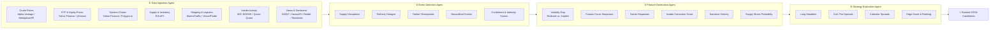

# Energy Options Opportunity Agent — User Guide

> **Version 1.0 • March 2026**
> This guide walks you through setting up, configuring, and running the full Energy Options Opportunity Agent pipeline from the command line. It assumes familiarity with Python and standard CLI tooling.

---

## Table of Contents

1. [Overview](#overview)
2. [Prerequisites](#prerequisites)
3. [Setup & Configuration](#setup--configuration)
4. [Running the Pipeline](#running-the-pipeline)
5. [Interpreting the Output](#interpreting-the-output)
6. [Troubleshooting](#troubleshooting)

---

## Overview

The Energy Options Opportunity Agent is an autonomous, modular Python pipeline that identifies options trading opportunities driven by oil market instability. It ingests market data, supply signals, news events, and alternative datasets, then produces structured, ranked candidate options strategies — all without requiring automated trade execution.

### How the pipeline works

Data flows unidirectionally through four loosely coupled agents, each operating on a shared market state object:


```mermaid
flowchart LR
    subgraph Ingestion ["① Data Ingestion Agent"]
        A1[Crude Prices\nAlpha Vantage / MetalpriceAPI]
        A2[ETF & Equity Prices\nYahoo Finance / yfinance]
        A3[Options Chains\nYahoo Finance / Polygon.io]
        A4[Supply & Inventory\nEIA API]
        A5[Shipping & Logistics\nMarineTraffic / VesselFinder]
        A6[Insider Activity\nSEC EDGAR / Quiver Quant]
        A7[News & Sentiment\nGDELT / NewsAPI / Reddit / Stocktwits]
    end

    subgraph Event ["② Event Detection Agent"]
        B1[Supply Disruptions]
        B2[Refinery Outages]
        B3[Tanker Chokepoints]
        B4[Geopolitical Events]
        B5[Confidence & Intensity Scores]
    end

    subgraph Feature ["③ Feature Generation Agent"]
        C1[Volatility Gap\nRealized vs. Implied]
        C2[Futures Curve Steepness]
        C3[Sector Dispersion]
        C4[Insider Conviction Score]
        C5[Narrative Velocity]
        C6[Supply Shock Probability]
    end

    subgraph Strategy ["④ Strategy Evaluation Agent"]
        D1[Long Straddles]
        D2[Call / Put Spreads]
        D3[Calendar Spreads]
        D4[Edge Score & Ranking]
    end

    Output["📄 Ranked JSON Candidates"]

    Ingestion --> Event
    Event --> Feature
    Feature --> Strategy
    Strategy --> Output
```

### In-scope instruments

| Category | Instruments |
|---|---|
| Crude futures | WTI (`CL=F`), Brent Crude |
| ETFs | USO, XLE |
| Energy equities | Exxon Mobil (`XOM`), Chevron (`CVX`) |

### In-scope option structures (MVP)

| Structure | Enum value |
|---|---|
| Long straddle | `long_straddle` |
| Call spread | `call_spread` |
| Put spread | `put_spread` |
| Calendar spread | `calendar_spread` |

> **Advisory only.** The system produces ranked recommendations. No automated trade execution occurs.

---

## Prerequisites

Before running the pipeline, ensure your environment meets the following requirements.

### Software

| Requirement | Minimum version | Notes |
|---|---|---|
| Python | 3.10+ | 3.11 recommended |
| pip | 22+ | Bundled with Python 3.10+ |
| git | 2.x | For cloning the repository |
| Docker *(optional)* | 24+ | For containerised deployment |

### Python dependencies

Install all dependencies from the project root:

```bash
pip install -r requirements.txt
```

Key packages include `yfinance`, `requests`, `pandas`, `numpy`, and `pydantic`. Consult `requirements.txt` for the full pinned list.

### API access

The pipeline relies on free or low-cost external data sources. Obtain API keys where required before first run.

| Data source | Required key | Sign-up URL | Notes |
|---|---|---|---|
| Alpha Vantage | Yes | https://www.alphavantage.co/support/#api-key | Free tier; WTI/Brent prices |
| MetalpriceAPI | Optional | https://metalpriceapi.com | Alternative crude price feed |
| Polygon.io | Optional | https://polygon.io | Enhanced options chain data |
| EIA API | Yes | https://www.eia.gov/opendata/ | Free; inventory & refinery data |
| NewsAPI | Yes | https://newsapi.org | Free tier; energy headlines |
| GDELT | No | — | No key required; open dataset |
| SEC EDGAR | No | — | No key required; public filings |
| Quiver Quant | Optional | https://www.quiverquant.com | Enhanced insider activity |
| MarineTraffic | Optional | https://www.marinetraffic.com | Free tier; tanker flows |
| Reddit API | Optional | https://www.reddit.com/prefs/apps | Narrative/sentiment signals |
| Stocktwits | Optional | https://api.stocktwits.com/developers | Narrative/sentiment signals |

> **Tip:** The pipeline is designed to tolerate delayed or missing data without failing. Optional sources can be omitted for early testing — their corresponding signals will be absent from the output but the pipeline will still complete.

---

## Setup & Configuration

### 1. Clone the repository

```bash
git clone https://github.com/your-org/energy-options-agent.git
cd energy-options-agent
```

### 2. Create and activate a virtual environment

```bash
python -m venv .venv
source .venv/bin/activate        # macOS / Linux
.venv\Scripts\activate           # Windows
```

### 3. Install dependencies

```bash
pip install -r requirements.txt
```

### 4. Configure environment variables

Copy the provided template and populate your values:

```bash
cp .env.example .env
```

Open `.env` in your editor and set each variable. The full set of supported environment variables is described in the table below.

#### Environment variable reference

| Variable | Required | Default | Description |
|---|---|---|---|
| `ALPHA_VANTAGE_API_KEY` | Yes | — | API key for Alpha Vantage crude price feed |
| `METALPRICE_API_KEY` | No | — | API key for MetalpriceAPI (fallback crude prices) |
| `POLYGON_API_KEY` | No | — | API key for Polygon.io options chain data |
| `EIA_API_KEY` | Yes | — | API key for EIA supply/inventory data |
| `NEWS_API_KEY` | Yes | — | API key for NewsAPI geopolitical/energy headlines |
| `QUIVER_API_KEY` | No | — | API key for Quiver Quant insider activity |
| `MARINE_TRAFFIC_API_KEY` | No | — | API key for MarineTraffic tanker flow data |
| `REDDIT_CLIENT_ID` | No | — | Reddit OAuth client ID |
| `REDDIT_CLIENT_SECRET` | No | — | Reddit OAuth client secret |
| `STOCKTWITS_API_KEY` | No | — | Stocktwits API key for sentiment signals |
| `DATA_DIR` | No | `./data` | Local path for raw and derived historical data storage |
| `OUTPUT_DIR` | No | `./output` | Directory where JSON candidate files are written |
| `LOG_LEVEL` | No | `INFO` | Logging verbosity: `DEBUG`, `INFO`, `WARNING`, `ERROR` |
| `MARKET_DATA_INTERVAL_MINUTES` | No | `5` | Cadence for minute-level market data refresh |
| `HISTORY_RETENTION_DAYS` | No | `365` | Days of historical data retained for backtesting (180–365 recommended) |
| `EDGE_SCORE_THRESHOLD` | No | `0.0` | Minimum edge score `[0.0–1.0]` for a candidate to appear in output |
| `MVP_PHASE` | No | `1` | Active MVP phase (`1`–`3`); controls which agents and signals are enabled |

#### Example `.env`

```dotenv
# Required
ALPHA_VANTAGE_API_KEY=your_alpha_vantage_key
EIA_API_KEY=your_eia_key
NEWS_API_KEY=your_newsapi_key

# Optional — omit to skip those signal layers
POLYGON_API_KEY=
QUIVER_API_KEY=
MARINE_TRAFFIC_API_KEY=
REDDIT_CLIENT_ID=
REDDIT_CLIENT_SECRET=
STOCKTWITS_API_KEY=

# Pipeline settings
DATA_DIR=./data
OUTPUT_DIR=./output
LOG_LEVEL=INFO
MARKET_DATA_INTERVAL_MINUTES=5
HISTORY_RETENTION_DAYS=365
EDGE_SCORE_THRESHOLD=0.20
MVP_PHASE=2
```

### 5. Initialise local storage

Create the data and output directories (if not using the defaults):

```bash
mkdir -p data output
```

---

## Running the Pipeline

### Single run (one-shot evaluation)

Execute the full four-agent pipeline once and write candidates to `OUTPUT_DIR`:

```bash
python -m agent.pipeline run
```

### Continuous mode (scheduled refresh)

Run the pipeline on a repeating cadence driven by `MARKET_DATA_INTERVAL_MINUTES`:

```bash
python -m agent.pipeline run --continuous
```

Press `Ctrl+C` to stop.

### Run a specific agent only

Each agent can be invoked independently for debugging or incremental development:

```bash
# Data Ingestion Agent only
python -m agent.pipeline run --agent ingestion

# Event Detection Agent only
python -m agent.pipeline run --agent event_detection

# Feature Generation Agent only
python -m agent.pipeline run --agent feature_generation

# Strategy Evaluation Agent only
python -m agent.pipeline run --agent strategy_evaluation
```

> **Note:** Running `strategy_evaluation` in isolation requires a pre-existing market state and derived features store on disk (produced by prior runs of the upstream agents).

### Selecting an MVP phase

Override the active phase at runtime without editing `.env`:

```bash
python -m agent.pipeline run --phase 2
```

| Phase flag | Agents & signals active |
|---|---|
| `--phase 1` | Core market data, options surface, long straddles, call/put spreads |
| `--phase 2` | Phase 1 + EIA inventory, refinery utilisation, GDELT/NewsAPI event detection, supply disruption indices |
| `--phase 3` | Phase 2 + insider trades, narrative velocity, shipping data, cross-sector correlation |

### Docker (optional)

Build and run the pipeline in a container:

```bash
docker build -t energy-options-agent .

docker run --env-file .env \
  -v "$(pwd)/data:/app/data" \
  -v "$(pwd)/output:/app/output" \
  energy-options-agent
```

Add `--continuous` as a Docker `CMD` argument or append it to the `docker run` command for scheduled execution inside the container.

---

## Interpreting the Output

### Output location

Each pipeline run appends or overwrites a JSON file in `OUTPUT_DIR`:

```
output/
└── candidates_<ISO8601_timestamp>.json
```

### Output schema

Each strategy candidate is a JSON object with the following fields:

| Field | Type | Description |
|---|---|---|
| `instrument` | `string` | Target instrument, e.g. `USO`, `XLE`, `CL=F` |
| `structure` | `enum` | `long_straddle` \| `call_spread` \| `put_spread` \| `calendar_spread` |
| `expiration` | `integer` (days) | Target expiration in calendar days from evaluation date |
| `edge_score` | `float [0.0–1.0]` | Composite opportunity score; higher = stronger signal confluence |
| `signals` | `object` | Map of contributing signals and their observed state |
| `generated_at` | ISO 8601 datetime | UTC timestamp of candidate generation |

### Example candidate

```json
{
  "instrument": "USO",
  "structure": "long_straddle",
  "expiration": 30,
  "edge_score": 0.47,
  "signals": {
    "tanker_disruption_index": "high",
    "volatility_gap": "positive",
    "narrative_velocity": "rising"
  },
  "generated_at": "2026-03-15T14:32:00Z"
}
```

### Understanding the `edge_score`

The edge score is a composite float between `0.0` and `1.0` that reflects signal confluence across all active agents.

| Score range | Interpretation |
|---|---|
| `0.00 – 0.25` | Weak or noisy signal; low confidence |
| `0.25 – 0.50` | Moderate signal; worth monitoring |
| `0.50 – 0.75` | Strong signal confluence; higher-priority candidate |
| `0.75 – 1.00` | Very strong confluence; highest-priority candidate |

> The edge score is a heuristic composite in the current MVP. Signal weights are static and are not ML-derived until Phase 4. Treat it as a relative ranking tool, not an absolute probability estimate.

### Understanding the `signals` map

Each key in the `signals` object corresponds to a derived feature computed by the Feature Generation Agent. Common keys and their possible values are listed below.

| Signal key | Possible values | Source agent |
|---|---|---|
| `volatility_gap` | `positive`, `neutral`, `negative` | Feature Generation |
| `futures_curve_steepness` | `contango`, `flat`, `backwardation` | Feature Generation |
| `sector_dispersion` | `high`, `moderate`, `low` | Feature Generation |
| `insider_conviction_score` | `high`, `moderate`, `low` | Feature Generation |
| `narrative_velocity` | `rising`, `stable`, `falling` | Feature Generation |
| `supply_shock_probability` | `high`, `moderate`, `low` | Feature Generation |
| `tanker_disruption_index` | `high`, `moderate`, `low` | Event Detection |
| `supply_disruption_event` | `detected`, `none` | Event Detection |
| `refinery_outage_flag` | `true`, `false` | Event Detection |

### Consuming output downstream

The JSON output is compatible with any JSON-capable dashboard or visualization tool. To load candidates into a pandas DataFrame for further analysis:

```python
import json
import pandas as pd

with open("output/candidates_2026-03-15T143200Z.json") as f:
    candidates = json.load(f)

df = pd.json_normalize(candidates)
df_sorted = df.sort_values("edge_score", ascending=False)
print(df_sorted[["instrument", "structure", "expiration", "edge_score"]])
```

---

## Troubleshooting

### Common issues

| Symptom | Likely cause | Resolution |
|---|---|---|
| `KeyError: 'ALPHA_VANTAGE_API_KEY'` | Missing required environment variable | Ensure `.env` is populated and loaded; check `cp .env.example .env` was run |
| `Pipeline completed with 0 candidates` | `EDGE_SCORE_THRESHOLD` too high, or all signals are missing | Lower `EDGE_SCORE_THRESHOLD` to `0.0` and check that at least one required API key is valid |
| `HTTPError 429` from a data source | Rate limit exceeded on free tier | Increase `MARKET_DATA_INTERVAL_MINUTES`; consider staggering agent runs |
| Missing signals in `signals` map | Optional data source not configured | Expected behaviour when API keys for optional sources are absent; add the key to `.env` to enable the signal layer |
| Stale or empty `data/` directory | Pipeline never completed ingestion | Run ingestion agent alone: `python -m agent.pipeline run --agent ingestion` and check logs for errors |
| `ModuleNotFoundError` | Dependencies not installed in active environment | Confirm the virtual environment is activated and run `pip install -r requirements.txt` |
| Output JSON file not created | `OUTPUT_DIR` does not exist or is not writable | Run