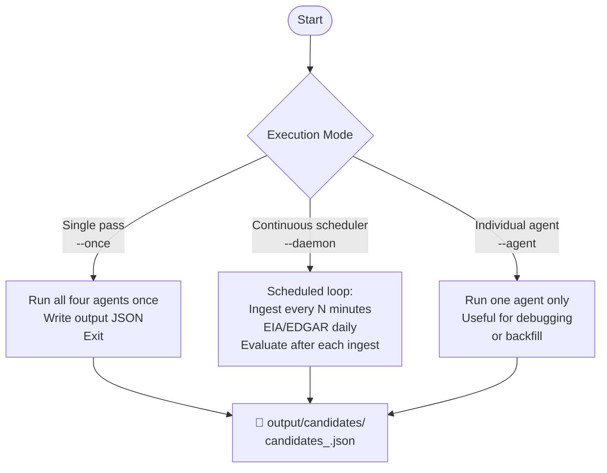

# Energy Options Opportunity Agent — User Guide

> **Version 1.0 · March 2026**
> This guide walks you through setting up, configuring, and running the full pipeline end-to-end, then interpreting and troubleshooting the output.

---

## Table of Contents

1. [Overview](#overview)
2. [Prerequisites](#prerequisites)
3. [Setup & Configuration](#setup--configuration)
4. [Running the Pipeline](#running-the-pipeline)
5. [Interpreting the Output](#interpreting-the-output)
6. [Troubleshooting](#troubleshooting)

---

## Overview

The **Energy Options Opportunity Agent** is a four-stage autonomous pipeline that identifies options trading opportunities driven by oil market instability. It ingests raw market and alternative data, detects geopolitical and supply events, computes derived signals, and ranks candidate options strategies by a composite **edge score**.

### Pipeline Architecture


```mermaid
flowchart LR
    A["📥 Data Ingestion Agent\n──────────────────\nFetch & normalize\ncrude prices, ETFs,\nequities, options chains"]
    B["🔍 Event Detection Agent\n──────────────────\nMonitor news & geo feeds\nScore supply disruptions\n& geopolitical events"]
    C["⚙️ Feature Generation Agent\n──────────────────\nCompute vol gaps,\ncurve steepness,\nsector dispersion, etc."]
    D["🎯 Strategy Evaluation Agent\n──────────────────\nRank option structures\nby edge score with\nfull signal explainability"]

    RAW["Raw Feeds\n(Alpha Vantage, yfinance,\nEIA, GDELT, EDGAR, …)"]
    OUT["Structured JSON Output\n(ranked candidates)"]

    RAW --> A
    A -->|"Unified market\nstate object"| B
    B -->|"Scored events\n+ market state"| C
    C -->|"Derived features\nstore"| D
    D --> OUT

    style A fill:#1e3a5f,color:#fff,stroke:#4a90d9
    style B fill:#1e3a5f,color:#fff,stroke:#4a90d9
    style C fill:#1e3a5f,color:#fff,stroke:#4a90d9
    style D fill:#1e3a5f,color:#fff,stroke:#4a90d9
    style RAW fill:#2d2d2d,color:#ccc,stroke:#666
    style OUT fill:#1a4731,color:#fff,stroke:#2ecc71
```

Data flows **unidirectionally** through the four agents. Each agent is loosely coupled and independently deployable, so you can update or restart any single stage without disrupting the others.

### In-Scope Instruments & Structures (MVP)

| Category | Items |
|---|---|
| Crude futures | Brent Crude, WTI (`CL=F`) |
| ETFs | USO, XLE |
| Energy equities | Exxon Mobil (XOM), Chevron (CVX) |
| Option structures | Long straddles, call/put spreads, calendar spreads |

> **Advisory only.** The pipeline produces ranked recommendations; it does **not** execute trades automatically.

---

## Prerequisites

### System Requirements

| Requirement | Minimum |
|---|---|
| Python | 3.10 or later |
| RAM | 2 GB |
| Disk | 10 GB (for 6–12 months of historical data) |
| OS | Linux, macOS, or Windows (WSL2 recommended) |
| Deployment target | Local machine, single VM, or container |

### Required Accounts & API Keys

Obtain free-tier credentials from each provider before configuration.

| Provider | Used By | Cost | Sign-Up URL |
|---|---|---|---|
| Alpha Vantage | Crude prices (WTI, Brent) | Free | `https://www.alphavantage.co` |
| Yahoo Finance / yfinance | ETF & equity prices, options chains | Free | *(no key needed)* |
| Polygon.io | Options chains (optional supplement) | Free/Limited | `https://polygon.io` |
| EIA API | Inventory & refinery utilization | Free | `https://www.eia.gov/opendata/` |
| GDELT | News & geopolitical events | Free | `https://www.gdeltproject.org` |
| NewsAPI | News headlines | Free/Daily | `https://newsapi.org` |
| SEC EDGAR | Insider activity | Free | `https://efts.sec.gov/LATEST/` |
| Quiver Quant | Insider activity (supplement) | Free/Limited | `https://www.quiverquant.com` |
| MarineTraffic | Tanker/shipping flows | Free tier | `https://www.marinetraffic.com` |
| Reddit API | Narrative/sentiment velocity | Free | `https://www.reddit.com/prefs/apps` |
| Stocktwits API | Narrative/sentiment velocity | Free | `https://api.stocktwits.com` |

### Python Dependencies

```bash
pip install -r requirements.txt
```

A minimal `requirements.txt` includes:

```text
requests>=2.31
yfinance>=0.2
pandas>=2.0
numpy>=1.26
pydantic>=2.0
python-dotenv>=1.0
schedule>=1.2
```

---

## Setup & Configuration

### 1. Clone the Repository

```bash
git clone https://github.com/your-org/energy-options-agent.git
cd energy-options-agent
```

### 2. Create a Virtual Environment

```bash
python -m venv .venv
source .venv/bin/activate        # Linux / macOS
# .venv\Scripts\activate         # Windows PowerShell
pip install -r requirements.txt
```

### 3. Configure Environment Variables

Copy the provided template and populate your credentials:

```bash
cp .env.example .env
```

Open `.env` in your editor and fill in the values listed in the table below. The pipeline reads all configuration from this file via `python-dotenv`.

#### Full Environment Variable Reference

| Variable | Required | Description | Default |
|---|---|---|---|
| `ALPHA_VANTAGE_API_KEY` | ✅ | API key for crude price feeds (WTI, Brent) | — |
| `POLYGON_API_KEY` | ⬜ | API key for supplemental options chain data | — |
| `EIA_API_KEY` | ✅ | API key for EIA inventory & refinery data | — |
| `NEWS_API_KEY` | ✅ | API key for NewsAPI headline feed | — |
| `QUIVER_API_KEY` | ⬜ | API key for Quiver Quant insider data | — |
| `MARINE_TRAFFIC_API_KEY` | ⬜ | API key for MarineTraffic tanker data | — |
| `REDDIT_CLIENT_ID` | ⬜ | Reddit OAuth client ID | — |
| `REDDIT_CLIENT_SECRET` | ⬜ | Reddit OAuth client secret | — |
| `REDDIT_USER_AGENT` | ⬜ | Reddit OAuth user-agent string | `energy-agent/1.0` |
| `STOCKTWITS_API_KEY` | ⬜ | Stocktwits API key | — |
| `DATA_DIR` | ✅ | Directory for raw and derived data storage | `./data` |
| `OUTPUT_DIR` | ✅ | Directory where JSON output files are written | `./output` |
| `LOG_LEVEL` | ⬜ | Logging verbosity (`DEBUG`, `INFO`, `WARNING`) | `INFO` |
| `INGEST_INTERVAL_MINUTES` | ⬜ | Cadence for market data refresh | `5` |
| `EIA_POLL_INTERVAL_HOURS` | ⬜ | Cadence for EIA (weekly data) polling | `24` |
| `RETENTION_DAYS` | ⬜ | Days of historical data to retain for backtesting | `365` |
| `EDGE_SCORE_THRESHOLD` | ⬜ | Minimum edge score to include in output | `0.0` |
| `MAX_EXPIRATION_DAYS` | ⬜ | Maximum target expiration (calendar days) to evaluate | `90` |

> **Tip — optional keys:** Variables marked ⬜ are optional for the MVP. The pipeline is designed to tolerate missing feeds gracefully (see [Non-Functional Resilience](#troubleshooting)). Agents that cannot reach a configured source will log a warning and continue with the data they have.

Example `.env`:

```dotenv
# --- Required ---
ALPHA_VANTAGE_API_KEY=YOUR_AV_KEY
EIA_API_KEY=YOUR_EIA_KEY
NEWS_API_KEY=YOUR_NEWSAPI_KEY
DATA_DIR=./data
OUTPUT_DIR=./output

# --- Optional supplemental feeds ---
POLYGON_API_KEY=
QUIVER_API_KEY=
MARINE_TRAFFIC_API_KEY=
REDDIT_CLIENT_ID=
REDDIT_CLIENT_SECRET=
REDDIT_USER_AGENT=energy-agent/1.0
STOCKTWITS_API_KEY=

# --- Pipeline tuning ---
LOG_LEVEL=INFO
INGEST_INTERVAL_MINUTES=5
EIA_POLL_INTERVAL_HOURS=24
RETENTION_DAYS=365
EDGE_SCORE_THRESHOLD=0.0
MAX_EXPIRATION_DAYS=90
```

### 4. Initialise the Data Directory

```bash
python -m agent.setup --init
```

This command creates the directory structure and verifies that all required API keys can reach their respective endpoints.

```
data/
├── raw/
│   ├── prices/
│   ├── options/
│   ├── events/
│   └── alternative/
├── derived/
│   └── features/
output/
└── candidates/
```

---

## Running the Pipeline

### Pipeline Execution Modes


```mermaid
flowchart TD
    Start([Start]) --> Mode{Execution Mode}
    Mode -->|"Single pass\n--once"| Once["Run all four agents once\nWrite output JSON\nExit"]
    Mode -->|"Continuous scheduler\n--daemon"| Daemon["Scheduled loop:\nIngest every N minutes\nEIA/EDGAR daily\nEvaluate after each ingest"]
    Mode -->|"Individual agent\n--agent <name>"| Single["Run one agent only\nUseful for debugging\nor backfill"]
    Once --> Output["📄 output/candidates/\ncandidates_<timestamp>.json"]
    Daemon --> Output
    Single --> Output
```

### Run a Single Full Pass

Use this to test the pipeline or generate a one-off snapshot of ranked candidates:

```bash
python -m agent.pipeline --once
```

Expected console output:

```
[INFO]  2026-03-15T09:00:00Z  DataIngestionAgent     Starting fetch: WTI, Brent, USO, XLE, XOM, CVX
[INFO]  2026-03-15T09:00:04Z  DataIngestionAgent     Options chains fetched for 6 instruments
[INFO]  2026-03-15T09:00:05Z  DataIngestionAgent     Market state written to data/raw/
[INFO]  2026-03-15T09:00:05Z  EventDetectionAgent    Polling GDELT and NewsAPI …
[INFO]  2026-03-15T09:00:07Z  EventDetectionAgent    3 events detected; scores assigned
[INFO]  2026-03-15T09:00:07Z  FeatureGenerationAgent Computing derived signals …
[INFO]  2026-03-15T09:00:08Z  FeatureGenerationAgent Features written to data/derived/features/
[INFO]  2026-03-15T09:00:08Z  StrategyEvaluationAgent Evaluating option structures …
[INFO]  2026-03-15T09:00:09Z  StrategyEvaluationAgent 12 candidates generated; ranked by edge score
[INFO]  2026-03-15T09:00:09Z  StrategyEvaluationAgent Output: output/candidates/candidates_20260315T090009Z.json
```

### Run as a Continuous Daemon

Keeps the pipeline running on the configured refresh schedule. Market data is fetched every `INGEST_INTERVAL_MINUTES` minutes; slower feeds (EIA, EDGAR) are polled on their daily/weekly cadences.

```bash
python -m agent.pipeline --daemon
```

To run as a background process:

```bash
nohup python -m agent.pipeline --daemon > logs/pipeline.log 2>&1 &
```

### Run an Individual Agent

Useful for debugging a specific stage or backfilling data without triggering downstream evaluation.

```bash
# Run only the Data Ingestion Agent
python -m agent.pipeline --agent ingestion

# Run only the Event Detection Agent
python -m agent.pipeline --agent events

# Run only the Feature Generation Agent
python -m agent.pipeline --agent features

# Run only the Strategy Evaluation Agent (requires features already on disk)
python -m agent.pipeline --agent strategy
```

### Common CLI Flags

| Flag | Description |
|---|---|
| `--once` | Execute one full pipeline pass and exit |
| `--daemon` | Run continuously on configured schedule |
| `--agent <name>` | Run a single agent (`ingestion`, `events`, `features`, `strategy`) |
| `--log-level DEBUG` | Override log verbosity for this run |
| `--output-dir <path>` | Override `OUTPUT_DIR` for this run |
| `--dry-run` | Fetch and compute, but do not write output files |
| `--help` | Show all available options |

---

## Interpreting the Output

### Output File Location

Each pipeline run writes a timestamped JSON file:

```
output/candidates/candidates_<ISO8601_UTC>.json
```

### Output Schema

Each element in the output array represents one ranked strategy candidate.

| Field | Type | Description |
|---|---|---|
| `instrument` | `string` | Target instrument — e.g. `USO`, `XLE`, `CL=F` |
| `structure` | `enum` | Option structure: `long_straddle`, `call_spread`, `put_spread`, `calendar_spread` |
| `expiration` | `integer` | Target expiration in calendar days from evaluation date |
| `edge_score` | `float [0.0–1.0]` | Composite opportunity score; higher = stronger signal confluence |
| `signals` | `object` | Map of contributing signals and their qualitative state |
| `generated_at` | `ISO 8601 datetime` | UTC timestamp of candidate generation |

### Example Output File

```json
[
  {
    "instrument": "USO",
    "structure": "long_straddle",
    "expiration": 30,
    "edge_score": 0.47,
    "signals": {
      "tanker_disruption_index": "high",
      "volatility_gap": "positive",
      "narrative_velocity": "rising"
    },
    "generated_at": "2026-03-15T09:00:09Z"
  },
  {
    "instrument": "XLE",
    "structure": "call_spread",
    "expiration": 45,
    "edge_score": 0.31,
    "signals": {
      "volatility_gap": "positive",
      "eia_inventory_draw": "elevated",
      "sector_dispersion": "widening"
    },
    "generated_at": "2026-03-15T09:00:09Z"
  }
]
```

Candidates are **sorted descending by `edge_score`**; the strongest opportunity is always at index 0.

### Signal Reference

| Signal Key | What It Measures |
|---|---|
| `volatility_gap` | Difference between realized and implied volatility; `positive` means IV exceeds RV (potentially overpriced premium) |
| `futures_curve_steepness` | Degree of contango or backwardation in the crude curve |
| `sector_dispersion` | Spread in returns across energy equities; elevated = directional uncertainty |
| `insider_conviction_score` | Aggregated EDGAR/Quiver insider buying or selling activity score |
| `narrative_velocity` | Rate of change in