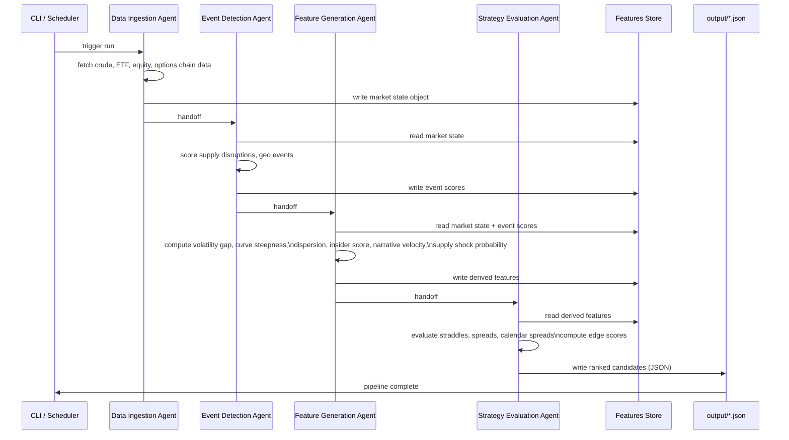

# Energy Options Opportunity Agent — User Guide

> **Version 1.0 • March 2026**
> This guide walks a developer through installing, configuring, and running the full pipeline end-to-end, then interpreting and troubleshooting its output.

---

## Table of Contents

1. [Overview](#overview)
2. [Prerequisites](#prerequisites)
3. [Setup & Configuration](#setup--configuration)
4. [Running the Pipeline](#running-the-pipeline)
5. [Interpreting the Output](#interpreting-the-output)
6. [Troubleshooting](#troubleshooting)

---

## Overview

The **Energy Options Opportunity Agent** is an autonomous, modular Python pipeline that identifies options trading opportunities driven by oil market instability. It is designed for a single contributor and emphasises low-cost, free-tier data feeds.

The pipeline is composed of four loosely coupled agents that execute in sequence, communicating through a shared **market state object** and a **derived features store**:


```mermaid
flowchart LR
    subgraph Ingestion["① Data Ingestion Agent"]
        A1[Crude Prices\nWTI · Brent]
        A2[ETF & Equity Prices\nUSO · XLE · XOM · CVX]
        A3[Options Chains\nStrike · Expiry · IV · Volume]
    end

    subgraph Events["② Event Detection Agent"]
        B1[Supply Disruptions]
        B2[Refinery Outages]
        B3[Tanker Chokepoints]
        B4[Geopolitical Events]
    end

    subgraph Features["③ Feature Generation Agent"]
        C1[Volatility Gap\nRealised vs Implied]
        C2[Futures Curve Steepness]
        C3[Sector Dispersion]
        C4[Insider Conviction Score]
        C5[Narrative Velocity]
        C6[Supply Shock Probability]
    end

    subgraph Strategy["④ Strategy Evaluation Agent"]
        D1[Long Straddle]
        D2[Call / Put Spread]
        D3[Calendar Spread]
    end

    RAW[(Market State\nObject)] --> Events
    Ingestion --> RAW
    Events --> FEAT[(Derived\nFeatures Store)]
    Features --> FEAT
    RAW --> Features
    FEAT --> Strategy
    Strategy --> OUT["📄 Ranked JSON\nCandidates"]
```

**Key characteristics:**

| Property | Detail |
|---|---|
| Instruments | Brent, WTI, USO, XLE, XOM, CVX |
| Option structures (MVP) | Long straddle, call/put spread, calendar spread |
| Output format | JSON-compatible ranked candidate list |
| Execution mode | Advisory only — no automated trade execution |
| Deployment target | Local machine or single VM / container |

---

## Prerequisites

### System Requirements

| Requirement | Minimum |
|---|---|
| Python | 3.10 or later |
| RAM | 2 GB |
| Disk | 5 GB free (for 6–12 months of historical data) |
| OS | Linux, macOS, or Windows (WSL recommended on Windows) |

### External Accounts & API Keys

All data sources used in the MVP are free or offer a free tier. Obtain credentials before running the pipeline.

| Data Layer | Source | Registration URL | Free Tier |
|---|---|---|---|
| Crude prices | Alpha Vantage | <https://www.alphavantage.co/support/#api-key> | Yes |
| Crude prices (alt) | MetalpriceAPI | <https://metalpriceapi.com> | Yes |
| ETF / equity prices | Yahoo Finance (`yfinance`) | No key required | Yes |
| Options chains | Polygon.io | <https://polygon.io> | Limited |
| Supply / inventory | EIA Open Data API | <https://www.eia.gov/opendata/> | Yes |
| News & geo events | NewsAPI | <https://newsapi.org> | Yes |
| News & geo events | GDELT | No key required | Yes |
| Insider activity | SEC EDGAR | No key required | Yes |
| Insider activity (alt) | Quiver Quantitative | <https://www.quiverquant.com> | Limited |
| Shipping / logistics | MarineTraffic | <https://www.marinetraffic.com/en/p/api-services> | Free tier |
| Sentiment | Reddit / Stocktwits | No key required for public feeds | Yes |

### Python Dependencies

```bash
pip install -r requirements.txt
```

A representative `requirements.txt`:

```text
yfinance>=0.2
requests>=2.31
pandas>=2.0
numpy>=1.26
pydantic>=2.0
python-dotenv>=1.0
schedule>=1.2
```

---

## Setup & Configuration

### 1. Clone the Repository

```bash
git clone https://github.com/your-org/energy-options-agent.git
cd energy-options-agent
```

### 2. Create and Activate a Virtual Environment

```bash
python -m venv .venv
source .venv/bin/activate        # Linux / macOS
# .venv\Scripts\activate         # Windows (PowerShell)
```

### 3. Install Dependencies

```bash
pip install -r requirements.txt
```

### 4. Create the Environment File

Copy the provided template and populate it with your credentials:

```bash
cp .env.example .env
```

Then open `.env` in your editor and fill in the values described in the table below.

### Environment Variables Reference

All pipeline behaviour is controlled through environment variables loaded from `.env`. **Do not commit this file to version control.**

| Variable | Required | Default | Description |
|---|---|---|---|
| `ALPHA_VANTAGE_API_KEY` | Yes | — | API key for Alpha Vantage crude price feed |
| `METALPRICE_API_KEY` | Optional | — | Fallback crude price key (MetalpriceAPI) |
| `POLYGON_API_KEY` | Optional | — | Polygon.io key for options chain data |
| `EIA_API_KEY` | Yes | — | EIA Open Data API key (inventory & refinery data) |
| `NEWSAPI_KEY` | Yes | — | NewsAPI key for geopolitical / energy news |
| `QUIVER_API_KEY` | Optional | — | Quiver Quantitative key for insider trade data |
| `MARINETRAFFIC_API_KEY` | Optional | — | MarineTraffic key for tanker flow data |
| `OUTPUT_DIR` | No | `./output` | Directory where JSON candidate files are written |
| `HISTORY_DIR` | No | `./data/history` | Directory for persisted raw and derived historical data |
| `HISTORY_RETENTION_DAYS` | No | `365` | Days of historical data to retain (minimum 180) |
| `PIPELINE_CADENCE_MINUTES` | No | `5` | How often the pipeline reruns market data ingestion |
| `LOG_LEVEL` | No | `INFO` | Python logging level (`DEBUG`, `INFO`, `WARNING`, `ERROR`) |
| `EDGE_SCORE_THRESHOLD` | No | `0.20` | Minimum edge score for a candidate to appear in output |

**Example `.env`:**

```dotenv
ALPHA_VANTAGE_API_KEY=YOUR_AV_KEY_HERE
EIA_API_KEY=YOUR_EIA_KEY_HERE
NEWSAPI_KEY=YOUR_NEWSAPI_KEY_HERE
POLYGON_API_KEY=YOUR_POLYGON_KEY_HERE          # optional
QUIVER_API_KEY=YOUR_QUIVER_KEY_HERE            # optional
MARINETRAFFIC_API_KEY=YOUR_MT_KEY_HERE         # optional

OUTPUT_DIR=./output
HISTORY_DIR=./data/history
HISTORY_RETENTION_DAYS=365
PIPELINE_CADENCE_MINUTES=5
LOG_LEVEL=INFO
EDGE_SCORE_THRESHOLD=0.20
```

### 5. Initialise the Data Store

Run the one-time bootstrap command to create the required directory structure and seed empty historical stores:

```bash
python -m agent init
```

Expected output:

```
[INFO] Creating output directory:       ./output
[INFO] Creating history directory:      ./data/history
[INFO] Initialising historical stores...  done
[INFO] Bootstrap complete. Ready to run the pipeline.
```

---

## Running the Pipeline

### Pipeline Execution Flow


```mermaid
sequenceDiagram
    participant CLI as CLI / Scheduler
    participant DIA as Data Ingestion Agent
    participant EDA as Event Detection Agent
    participant FGA as Feature Generation Agent
    participant SEA as Strategy Evaluation Agent
    participant FS as Features Store
    participant OUT as output/*.json

    CLI->>DIA: trigger run
    DIA->>DIA: fetch crude, ETF, equity, options chain data
    DIA->>FS: write market state object
    DIA->>EDA: handoff
    EDA->>FS: read market state
    EDA->>EDA: score supply disruptions, geo events
    EDA->>FS: write event scores
    EDA->>FGA: handoff
    FGA->>FS: read market state + event scores
    FGA->>FGA: compute volatility gap, curve steepness,\ndispersion, insider score, narrative velocity,\nsupply shock probability
    FGA->>FS: write derived features
    FGA->>SEA: handoff
    SEA->>FS: read derived features
    SEA->>SEA: evaluate straddles, spreads, calendar spreads\ncompute edge scores
    SEA->>OUT: write ranked candidates (JSON)
    OUT->>CLI: pipeline complete
```

### Single Run (One-Shot)

Execute the entire pipeline once and write results to the output directory:

```bash
python -m agent run
```

To override the edge score threshold for this run only:

```bash
python -m agent run --edge-score-threshold 0.30
```

To target a specific instrument:

```bash
python -m agent run --instrument USO
```

### Scheduled / Continuous Mode

Run the pipeline on the cadence defined by `PIPELINE_CADENCE_MINUTES`:

```bash
python -m agent run --scheduled
```

The scheduler reruns market data ingestion (Agent 1) on the configured minutes cadence. Slower feeds (EIA weekly, EDGAR daily) are fetched on their own schedules automatically and do not re-trigger on every market tick.

### Running Individual Agents

Each agent can be executed independently for development or debugging:

```bash
python -m agent run --only ingestion
python -m agent run --only events
python -m agent run --only features
python -m agent run --only strategy
```

> **Note:** `events`, `features`, and `strategy` agents read from the features store written by the preceding agent. Run them in order if executing separately.

### Running Inside Docker

A `Dockerfile` is provided for containerised deployment on a single VM:

```bash
# Build the image
docker build -t energy-options-agent:latest .

# Run with your local .env file
docker run --env-file .env \
  -v $(pwd)/output:/app/output \
  -v $(pwd)/data:/app/data \
  energy-options-agent:latest python -m agent run --scheduled
```

---

## Interpreting the Output

### Output Location

Each pipeline run appends to (or creates) a dated JSON file in `OUTPUT_DIR`:

```
./output/
└── candidates_2026-03-15.json
```

### Output Schema

Each ranked candidate is a JSON object with the following fields:

| Field | Type | Description |
|---|---|---|
| `instrument` | `string` | Target instrument, e.g. `"USO"`, `"XLE"`, `"CL=F"` |
| `structure` | `enum` | One of `long_straddle`, `call_spread`, `put_spread`, `calendar_spread` |
| `expiration` | `integer` | Calendar days from evaluation date to target expiration |
| `edge_score` | `float [0.0–1.0]` | Composite opportunity score; higher = stronger signal confluence |
| `signals` | `object` | Map of contributing signals and their qualitative values |
| `generated_at` | `ISO 8601 datetime` | UTC timestamp of candidate generation |

### Example Output File

```json
[
  {
    "instrument": "USO",
    "structure": "long_straddle",
    "expiration": 30,
    "edge_score": 0.47,
    "signals": {
      "tanker_disruption_index": "high",
      "volatility_gap": "positive",
      "narrative_velocity": "rising"
    },
    "generated_at": "2026-03-15T14:32:00Z"
  },
  {
    "instrument": "XLE",
    "structure": "call_spread",
    "expiration": 21,
    "edge_score": 0.31,
    "signals": {
      "supply_shock_probability": "elevated",
      "sector_dispersion": "widening",
      "volatility_gap": "positive"
    },
    "generated_at": "2026-03-15T14:32:00Z"
  }
]
```

### Reading the Edge Score

| Edge Score Range | Interpretation |
|---|---|
| `0.70 – 1.00` | Strong signal confluence — high-priority candidate |
| `0.50 – 0.69` | Moderate confluence — worth detailed review |
| `0.30 – 0.49` | Weak confluence — monitor; do not act without corroboration |
| `< 0.30` | Below typical threshold — filtered out by default |

> The threshold for inclusion in output is set by `EDGE_SCORE_THRESHOLD` (default `0.20`). Raise this value to reduce noise.

### Signal Key Reference

| Signal Key | What It Measures |
|---|---|
| `volatility_gap` | Difference between realised and implied volatility; `"positive"` means IV is cheap relative to recent moves |
| `futures_curve_steepness` | Contango / backwardation of the crude futures curve |
| `sector_dispersion` | Spread in returns across energy sub-sectors (upstream, midstream, downstream) |
| `insider_conviction_score` | Aggregated directional signal from SEC EDGAR / Quiver insider trade filings |
| `narrative_velocity` | Rate of acceleration of energy-related headlines (Reddit, Stocktwits, NewsAPI) |
| `supply_shock_probability` | Probability estimate derived from EIA inventory anomalies and geo event scores |
| `tanker_disruption_index` | Intensity of tanker flow disruptions from MarineTraffic data |

### Consuming Output in thinkorswim

The JSON output is compatible with any JSON-capable dashboard. To load candidates into **thinkorswim**:

1. Export the JSON file from `OUTPUT_DIR`.
2. Use thinkorswim's **thinkScript** import or a third-party bridge (e.g., a watchlist CSV converter) to map `instrument` values to ticker symbols.
3. Filter the watchlist by `edge_score` descending for prioritisation.

> Automated execution is **out of scope** for the MVP. The pipeline is advisory only.

---

## Troubleshooting

### Common Errors

| Symptom | Likely Cause | Resolution |
|---|---|---|
| `KeyError: 'ALPHA_VANTAGE_API_KEY'` | `.env` not loaded or key missing | Confirm `.env` exists in the project root and contains the variable |
| `Pipeline failed at: Data Ingestion Agent` | Network timeout or rate-limit on a data source | Check connectivity; the pipeline tolerates missing data — re-run after a short wait |
| `No candidates generated` | `EDGE_SCORE_THRESHOLD` too high, or no signal confluence detected | Lower `EDGE_SCORE_THRESHOLD` temporarily; check `LOG_LEVEL=DEBUG` for signal values |
| `PermissionError` on `OUTPUT_DIR` or `HISTORY_DIR` | Directory is not writable | Run `chmod -R 755 ./output ./data` or adjust the path in `.env` |
| `yfinance` returns empty DataFrame | Yahoo Finance rate-limited or market closed | Retry during market hours; Yahoo Finance has no official SLA |
| `options chain data unavailable` | Polygon.io free-tier limit reached | Wait for quota reset or upgrade tier; pipeline degrades gracefully |
| Stale features store after agent crash | Previous run did not complete | Delete `