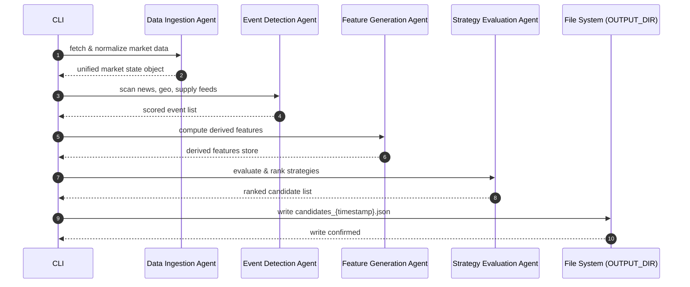

# Energy Options Opportunity Agent — User Guide

> **Version 1.0 · March 2026**
> This guide walks you through installing, configuring, and running the full pipeline end-to-end, then interpreting its output. It assumes you are comfortable with Python and the command line but are new to this project.

---

## Table of Contents

1. [Overview](#overview)
2. [Prerequisites](#prerequisites)
3. [Setup & Configuration](#setup--configuration)
4. [Running the Pipeline](#running-the-pipeline)
5. [Interpreting the Output](#interpreting-the-output)
6. [Troubleshooting](#troubleshooting)

---

## Overview

The **Energy Options Opportunity Agent** is an autonomous, modular Python pipeline that identifies options trading opportunities driven by oil market instability. It surfaces volatility mispricing in oil-related instruments, ranks candidate options strategies by a computed **edge score**, and provides full explainability for every recommendation.

### Pipeline Architecture

The system is composed of four loosely coupled agents that pass data through a shared market state object:


```mermaid
flowchart LR
    subgraph Sources["External Data Sources"]
        S1["Crude Prices\n(Alpha Vantage / MetalpriceAPI)"]
        S2["ETF & Equity Prices\n(yfinance / Yahoo Finance)"]
        S3["Options Chains\n(Yahoo Finance / Polygon.io)"]
        S4["Supply & Inventory\n(EIA API)"]
        S5["News & Geo Events\n(GDELT / NewsAPI)"]
        S6["Insider Activity\n(SEC EDGAR / Quiver Quant)"]
        S7["Shipping & Logistics\n(MarineTraffic / VesselFinder)"]
        S8["Narrative & Sentiment\n(Reddit / Stocktwits)"]
    end

    subgraph Pipeline["Agent Pipeline"]
        A1["🗄️ Data Ingestion Agent\nFetch & Normalize"]
        A2["🔍 Event Detection Agent\nSupply & Geo Signals"]
        A3["⚙️ Feature Generation Agent\nDerived Signal Computation"]
        A4["📊 Strategy Evaluation Agent\nOpportunity Ranking"]
    end

    subgraph Output["Output"]
        O1["Ranked Candidates\n(JSON)"]
    end

    Sources --> A1
    A1 -->|"Unified Market\nState Object"| A2
    A2 -->|"Scored Events +\nMarket State"| A3
    A3 -->|"Derived Features\nStore"| A4
    A4 --> O1
```

### In-Scope Instruments & Structures

| Category | Items |
|---|---|
| **Crude Futures** | Brent Crude, WTI (`CL=F`) |
| **ETFs** | USO, XLE |
| **Energy Equities** | Exxon Mobil (XOM), Chevron (CVX) |
| **Option Structures (MVP)** | Long straddles, call/put spreads, calendar spreads |

> **Advisory only.** The pipeline produces recommendations; it does **not** execute trades automatically.

---

## Prerequisites

### System Requirements

| Requirement | Minimum |
|---|---|
| Python | 3.10 or later |
| Operating System | Linux, macOS, or Windows (WSL recommended) |
| RAM | 2 GB |
| Disk | 5 GB free (for 6–12 months of historical data) |
| Network | Outbound HTTPS to data provider APIs |

### Required Accounts & API Keys

Obtain credentials for the following services before proceeding. All tiers listed are free unless noted.

| Service | Purpose | Sign-up URL |
|---|---|---|
| Alpha Vantage **or** MetalpriceAPI | WTI / Brent crude prices (minutes cadence) | `https://www.alphavantage.co` / `https://metalpriceapi.com` |
| Yahoo Finance / `yfinance` | ETF, equity, and options chain data | No key required (public) |
| Polygon.io *(optional)* | Higher-quality options chains | `https://polygon.io` |
| EIA API | Supply inventories, refinery utilization | `https://www.eia.gov/opendata/` |
| NewsAPI | News and geopolitical event feeds | `https://newsapi.org` |
| GDELT *(optional)* | Geopolitical event dataset | `https://www.gdeltproject.org` (no key required) |
| SEC EDGAR | Insider trading filings | `https://efts.sec.gov` (no key required) |
| Quiver Quant *(optional)* | Processed insider activity | `https://www.quiverquant.com` |
| MarineTraffic / VesselFinder | Tanker flow data (free tier) | `https://www.marinetraffic.com` |
| Reddit API | Narrative & sentiment velocity | `https://www.reddit.com/prefs/apps` |

### Python Dependencies

```bash
pip install -r requirements.txt
```

A minimal `requirements.txt` includes:

```text
yfinance>=0.2
requests>=2.31
pandas>=2.0
numpy>=1.26
python-dotenv>=1.0
pydantic>=2.0
schedule>=1.2
```

---

## Setup & Configuration

### 1. Clone the Repository

```bash
git clone https://github.com/your-org/energy-options-agent.git
cd energy-options-agent
```

### 2. Create a Virtual Environment

```bash
python -m venv .venv
source .venv/bin/activate        # Linux / macOS
# .venv\Scripts\activate         # Windows (CMD)
# .venv\Scripts\Activate.ps1     # Windows (PowerShell)
```

### 3. Install Dependencies

```bash
pip install --upgrade pip
pip install -r requirements.txt
```

### 4. Configure Environment Variables

Copy the provided template and populate your credentials:

```bash
cp .env.example .env
```

Open `.env` in your editor and fill in the values described in the table below.

#### Environment Variable Reference

| Variable | Required | Description | Example |
|---|---|---|---|
| `ALPHA_VANTAGE_API_KEY` | Yes¹ | API key for Alpha Vantage crude price feed | `ABC123XYZ` |
| `METALPRICE_API_KEY` | Yes¹ | API key for MetalpriceAPI (alternative to Alpha Vantage) | `abc123` |
| `POLYGON_API_KEY` | No | Polygon.io key for higher-quality options chains | `pQrSt789` |
| `EIA_API_KEY` | Yes | EIA Open Data API key for supply/inventory data | `eia_abc123` |
| `NEWS_API_KEY` | Yes | NewsAPI key for news and geopolitical event feeds | `na_key456` |
| `QUIVER_QUANT_API_KEY` | No | Quiver Quant key for processed insider activity | `qq_key789` |
| `MARINE_TRAFFIC_API_KEY` | No | MarineTraffic API key for tanker flow data | `mt_key000` |
| `REDDIT_CLIENT_ID` | No | Reddit OAuth client ID for sentiment feeds | `rdt_clientid` |
| `REDDIT_CLIENT_SECRET` | No | Reddit OAuth client secret | `rdt_secret` |
| `REDDIT_USER_AGENT` | No | Reddit API user agent string | `energy-agent/1.0` |
| `OUTPUT_DIR` | Yes | Directory where JSON output files are written | `./output` |
| `HISTORICAL_DATA_DIR` | Yes | Directory for persisted raw and derived historical data | `./data` |
| `LOG_LEVEL` | No | Logging verbosity: `DEBUG`, `INFO`, `WARNING`, `ERROR` | `INFO` |
| `MARKET_DATA_INTERVAL_MINUTES` | No | Polling interval for minute-cadence feeds (default: `5`) | `5` |
| `ENABLE_SHIPPING_SIGNALS` | No | Set to `true` to activate the MarineTraffic feed (Phase 3) | `false` |
| `ENABLE_INSIDER_SIGNALS` | No | Set to `true` to activate SEC EDGAR / Quiver Quant (Phase 3) | `false` |
| `ENABLE_SENTIMENT_SIGNALS` | No | Set to `true` to activate Reddit / Stocktwits (Phase 3) | `false` |

> ¹ Provide **either** `ALPHA_VANTAGE_API_KEY` or `METALPRICE_API_KEY`. Both may be set; the pipeline prefers Alpha Vantage and falls back to MetalpriceAPI.

#### Example `.env` file

```dotenv
# Crude price feed
ALPHA_VANTAGE_API_KEY=your_alpha_vantage_key

# Supply & inventory
EIA_API_KEY=your_eia_key

# News & events
NEWS_API_KEY=your_newsapi_key

# Output
OUTPUT_DIR=./output
HISTORICAL_DATA_DIR=./data

# Logging
LOG_LEVEL=INFO

# Polling cadence
MARKET_DATA_INTERVAL_MINUTES=5

# Phase 3 signals — disable for MVP
ENABLE_SHIPPING_SIGNALS=false
ENABLE_INSIDER_SIGNALS=false
ENABLE_SENTIMENT_SIGNALS=false
```

### 5. Initialize Storage Directories

```bash
mkdir -p ./output ./data
```

### 6. Verify Configuration

Run the built-in configuration check to confirm all required variables are present and API keys are reachable:

```bash
python -m agent.cli check-config
```

Expected output on success:

```
[OK] ALPHA_VANTAGE_API_KEY — reachable
[OK] EIA_API_KEY — reachable
[OK] NEWS_API_KEY — reachable
[OK] OUTPUT_DIR — ./output (exists)
[OK] HISTORICAL_DATA_DIR — ./data (exists)
Configuration check passed.
```

---

## Running the Pipeline

### Full Pipeline — Single Run

Execute all four agents in sequence once and write output to `OUTPUT_DIR`:

```bash
python -m agent.cli run
```

This performs the following steps in order:


```mermaid
sequenceDiagram
    autonumber
    participant CLI
    participant DIA as Data Ingestion Agent
    participant EDA as Event Detection Agent
    participant FGA as Feature Generation Agent
    participant SEA as Strategy Evaluation Agent
    participant FS as File System (OUTPUT_DIR)

    CLI->>DIA: fetch & normalize market data
    DIA-->>CLI: unified market state object

    CLI->>EDA: scan news, geo, supply feeds
    EDA-->>CLI: scored event list

    CLI->>FGA: compute derived features
    FGA-->>CLI: derived features store

    CLI->>SEA: evaluate & rank strategies
    SEA-->>CLI: ranked candidate list

    CLI->>FS: write candidates_{timestamp}.json
    FS-->>CLI: write confirmed
```

### Continuous Scheduled Run

To keep the pipeline running on a recurring cadence (market data refreshes every N minutes; slower feeds on daily/weekly schedule):

```bash
python -m agent.cli run --schedule
```

The scheduler honours the `MARKET_DATA_INTERVAL_MINUTES` environment variable for fast feeds, and runs EIA and SEC EDGAR pulls on daily / weekly cycles automatically.

Stop the scheduler with `Ctrl+C`.

### Running Individual Agents

Each agent can be invoked independently for development or debugging:

```bash
# Data Ingestion only
python -m agent.cli run --agent ingestion

# Event Detection only (reads existing market state from disk)
python -m agent.cli run --agent events

# Feature Generation only
python -m agent.cli run --agent features

# Strategy Evaluation only
python -m agent.cli run --agent strategy
```

### Common CLI Flags

| Flag | Description |
|---|---|
| `--dry-run` | Execute the full pipeline but do not write output files |
| `--log-level DEBUG` | Override `LOG_LEVEL` for this run only |
| `--output-dir PATH` | Override `OUTPUT_DIR` for this run only |
| `--schedule` | Run continuously on the configured cadence |
| `--agent AGENT_NAME` | Run a single agent: `ingestion`, `events`, `features`, `strategy` |

### Example: Debug a Single Run with Verbose Logging

```bash
python -m agent.cli run --log-level DEBUG --dry-run
```

---

## Interpreting the Output

### Output File Location

Each pipeline run produces a timestamped JSON file:

```
./output/candidates_2026-03-15T14:32:00Z.json
```

### Output Schema

The file contains an array of strategy candidate objects. Each object conforms to the following schema:

| Field | Type | Description |
|---|---|---|
| `instrument` | `string` | Target instrument — e.g. `"USO"`, `"XLE"`, `"CL=F"` |
| `structure` | `enum` | Options structure: `long_straddle` \| `call_spread` \| `put_spread` \| `calendar_spread` |
| `expiration` | `integer` | Target expiration in **calendar days** from the evaluation date |
| `edge_score` | `float [0.0–1.0]` | Composite opportunity score — higher values indicate stronger signal confluence |
| `signals` | `object` | Map of contributing signals and their current levels |
| `generated_at` | ISO 8601 datetime | UTC timestamp of candidate generation |

### Example Output

```json
[
  {
    "instrument": "USO",
    "structure": "long_straddle",
    "expiration": 30,
    "edge_score": 0.47,
    "signals": {
      "tanker_disruption_index": "high",
      "volatility_gap": "positive",
      "narrative_velocity": "rising"
    },
    "generated_at": "2026-03-15T14:32:00Z"
  },
  {
    "instrument": "XOM",
    "structure": "call_spread",
    "expiration": 21,
    "edge_score": 0.31,
    "signals": {
      "volatility_gap": "positive",
      "supply_shock_probability": "elevated",
      "insider_conviction_score": "moderate"
    },
    "generated_at": "2026-03-15T14:32:00Z"
  }
]
```

### Reading the Edge Score

The `edge_score` is a composite float between `0.0` and `1.0`. Use the following bands as a starting guide:

| Edge Score Range | Interpretation | Suggested Action |
|---|---|---|
| `0.70 – 1.00` | Strong signal confluence | Warrants close review; investigate contributing signals |
| `0.40 – 0.69` | Moderate confluence | Candidate of interest; monitor for confirmation |
| `0.20 – 0.39` | Weak confluence | Low-priority; may be surfaced for completeness |
| `0.00 – 0.19` | Minimal confluence | Likely noise; typically filtered in practice |

> **Note:** Edge score thresholds are heuristic-based in the MVP. Weighting will be refined iteratively in later phases.

### Understanding the `signals` Map

Each key in the `signals` object corresponds to a derived feature computed by the Feature Generation Agent. Common signal keys and their meaning:

| Signal Key | Description |
|---|---|
| `volatility_gap` | Relationship between realized and implied volatility (`positive` = IV underpricing) |
| `futures_curve_steepness` | Degree of contango or backwardation in the crude futures curve |
| `sector_dispersion` | Price divergence across energy sector constituents |
| `insider_conviction_score` | Aggregated signal strength from recent executive insider trades |
| `narrative_velocity` | Rate of acceleration in energy-related news headlines / social posts |
| `supply_shock_probability` | Estimated likelihood of a near-term supply disruption |
| `tanker_disruption_index` | Degree of disruption detected in global tanker shipping lanes |

### Consuming Output in thinkorswim or a Dashboard

The JSON output is designed to be directly importable into any JSON-capable dashboard or the thinkorswim platform. Point your visualization tool at the `OUTPUT_DIR` path and filter or sort by `edge_score` descending for the highest-priority