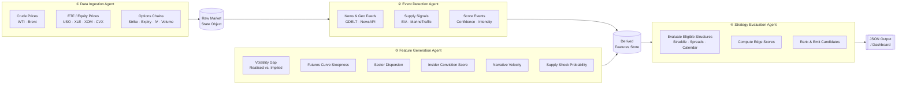

# Energy Options Opportunity Agent — User Guide

> **Version 1.0 • March 2026**
> This guide walks you through setting up, configuring, and running the full four-agent pipeline end-to-end. It assumes you are comfortable with Python and the command line but are new to this project.

---

## Table of Contents

1. [Overview](#overview)
2. [Prerequisites](#prerequisites)
3. [Setup & Configuration](#setup--configuration)
4. [Running the Pipeline](#running-the-pipeline)
5. [Interpreting the Output](#interpreting-the-output)
6. [Troubleshooting](#troubleshooting)

---

## Overview

The **Energy Options Opportunity Agent** is a modular, four-agent Python pipeline that detects volatility mispricing in oil-related instruments and surfaces ranked options trading candidates. It is designed for a single developer and is intentionally lightweight — the full stack runs on a local machine or a single low-cost cloud VM.

### Pipeline Architecture

Data flows unidirectionally through four loosely coupled agents. Each agent communicates with the next via a shared **market state object** and a **derived features store**.


```mermaid
flowchart LR
    subgraph Ingestion["① Data Ingestion Agent"]
        A1[Crude Prices\nWTI · Brent]
        A2[ETF / Equity Prices\nUSO · XLE · XOM · CVX]
        A3[Options Chains\nStrike · Expiry · IV · Volume]
    end

    subgraph Event["② Event Detection Agent"]
        B1[News & Geo Feeds\nGDELT · NewsAPI]
        B2[Supply Signals\nEIA · MarineTraffic]
        B3[Score Events\nConfidence · Intensity]
    end

    subgraph Feature["③ Feature Generation Agent"]
        C1[Volatility Gap\nRealised vs. Implied]
        C2[Futures Curve Steepness]
        C3[Sector Dispersion]
        C4[Insider Conviction Score]
        C5[Narrative Velocity]
        C6[Supply Shock Probability]
    end

    subgraph Strategy["④ Strategy Evaluation Agent"]
        D1[Evaluate Eligible Structures\nStraddle · Spreads · Calendar]
        D2[Compute Edge Scores]
        D3[Rank & Emit Candidates]
    end

    RAW[(Raw Market\nState Object)] --> Event
    Ingestion --> RAW
    Event --> DERIVED[(Derived\nFeatures Store)]
    Feature --> DERIVED
    DERIVED --> Strategy
    Strategy --> OUT[[JSON Output\n/ Dashboard]]
```

### In-Scope Instruments & Structures

| Category | Items |
|---|---|
| **Crude futures** | Brent Crude, WTI (`CL=F`) |
| **ETFs** | USO, XLE |
| **Energy equities** | Exxon Mobil (XOM), Chevron (CVX) |
| **Option structures (MVP)** | Long straddles, call/put spreads, calendar spreads |

> **Advisory only.** The pipeline produces recommendations; it does **not** execute trades automatically.

---

## Prerequisites

### Runtime Requirements

| Requirement | Minimum Version | Notes |
|---|---|---|
| Python | 3.10+ | Tested on 3.11 |
| pip | 23+ | Or use `pipx` / `poetry` |
| Git | Any recent | For cloning the repository |
| Disk space | ~5 GB | 6–12 months of historical data |
| RAM | 2 GB | 4 GB recommended for full signal stack |

### API Accounts

All sources used in the MVP are **free or free-tier**. Register for API keys before you configure the environment.

| Data Layer | Source | Registration URL | Free Tier Limits |
|---|---|---|---|
| Crude prices | Alpha Vantage | https://www.alphavantage.co | 25 req/day (free) |
| ETF / equity prices | yfinance (Yahoo Finance) | No key required | Unlimited (unofficial) |
| Options chains | Polygon.io | https://polygon.io | Free plan: daily delayed |
| Supply & inventory | EIA API | https://www.eia.gov/opendata | Free, no hard limit |
| News & geo events | NewsAPI | https://newsapi.org | 100 req/day (free) |
| News & geo events | GDELT | https://www.gdeltproject.org | Free, no key |
| Insider activity | SEC EDGAR | https://www.sec.gov/developer | Free, no key |
| Shipping / logistics | VesselFinder | https://www.vesselfinder.com | Free tier available |
| Narrative / sentiment | Reddit API | https://www.reddit.com/dev/api | Free (OAuth required) |

---

## Setup & Configuration

### 1. Clone the Repository

```bash
git clone https://github.com/your-org/energy-options-agent.git
cd energy-options-agent
```

### 2. Create and Activate a Virtual Environment

```bash
python -m venv .venv
source .venv/bin/activate        # Linux / macOS
# .venv\Scripts\activate.bat     # Windows CMD
# .venv\Scripts\Activate.ps1     # Windows PowerShell
```

### 3. Install Dependencies

```bash
pip install --upgrade pip
pip install -r requirements.txt
```

### 4. Configure Environment Variables

Copy the provided template and populate it with your API keys:

```bash
cp .env.example .env
```

Open `.env` in your editor and fill in the values described in the table below.

#### Environment Variable Reference

| Variable | Required | Description | Example |
|---|---|---|---|
| `ALPHA_VANTAGE_API_KEY` | Yes | API key for crude price feeds | `ABC123XYZ` |
| `POLYGON_API_KEY` | Yes | API key for options chain data | `pK_abc123` |
| `EIA_API_KEY` | Yes | API key for EIA supply/inventory data | `eia_abc123` |
| `NEWSAPI_KEY` | Yes | API key for NewsAPI energy headlines | `na_abc123` |
| `REDDIT_CLIENT_ID` | Phase 3 | OAuth client ID for Reddit API | `rXXXXXX` |
| `REDDIT_CLIENT_SECRET` | Phase 3 | OAuth client secret for Reddit API | `sXXXXXX` |
| `REDDIT_USER_AGENT` | Phase 3 | User-agent string for Reddit API | `energy-agent/1.0` |
| `VESSEL_FINDER_API_KEY` | Phase 3 | API key for VesselFinder shipping data | `vf_abc123` |
| `OUTPUT_DIR` | No | Directory for JSON output files | `./output` |
| `DATA_DIR` | No | Directory for persisted historical data | `./data` |
| `LOG_LEVEL` | No | Logging verbosity (`DEBUG`, `INFO`, `WARNING`) | `INFO` |
| `PIPELINE_CADENCE_MINUTES` | No | How often the pipeline re-runs in scheduler mode | `5` |
| `HISTORY_RETENTION_DAYS` | No | Days of historical data to retain on disk | `365` |
| `EDGE_SCORE_THRESHOLD` | No | Minimum edge score for a candidate to be emitted | `0.25` |

> **Phase 3 variables** (`REDDIT_*`, `VESSEL_FINDER_API_KEY`) are only required when running the full alternative-signals stack. Omitting them runs the pipeline in Phase 1/2 mode with a graceful warning.

#### Example `.env`

```dotenv
# === Core API Keys ===
ALPHA_VANTAGE_API_KEY=YOUR_ALPHA_VANTAGE_KEY
POLYGON_API_KEY=YOUR_POLYGON_KEY
EIA_API_KEY=YOUR_EIA_KEY
NEWSAPI_KEY=YOUR_NEWSAPI_KEY

# === Phase 3 Alternative Signals ===
REDDIT_CLIENT_ID=YOUR_REDDIT_CLIENT_ID
REDDIT_CLIENT_SECRET=YOUR_REDDIT_CLIENT_SECRET
REDDIT_USER_AGENT=energy-agent/1.0
VESSEL_FINDER_API_KEY=YOUR_VESSEL_FINDER_KEY

# === Pipeline Settings ===
OUTPUT_DIR=./output
DATA_DIR=./data
LOG_LEVEL=INFO
PIPELINE_CADENCE_MINUTES=5
HISTORY_RETENTION_DAYS=365
EDGE_SCORE_THRESHOLD=0.25
```

### 5. Initialise the Data Directories

```bash
mkdir -p output data
```

### 6. Verify Configuration

Run the built-in configuration check to confirm all required keys are reachable and data directories are writable:

```bash
python -m agent.cli check-config
```

Expected output:

```
[✓] ALPHA_VANTAGE_API_KEY   reachable
[✓] POLYGON_API_KEY         reachable
[✓] EIA_API_KEY             reachable
[✓] NEWSAPI_KEY             reachable
[✓] OUTPUT_DIR              writable  → ./output
[✓] DATA_DIR                writable  → ./data
[!] REDDIT_CLIENT_ID        not set   → Phase 3 signals disabled
[!] VESSEL_FINDER_API_KEY   not set   → Phase 3 signals disabled
Configuration OK — pipeline ready (Phase 1/2 mode)
```

Warnings (`[!]`) indicate optional Phase 3 keys; they do not block the pipeline.

---

## Running the Pipeline

The pipeline is invoked through the `agent.cli` module. The two primary modes are **single-run** (run once and exit) and **scheduled** (loop continuously on a configurable cadence).

### Single Run

Execute the full four-agent pipeline once and write output to `OUTPUT_DIR`:

```bash
python -m agent.cli run
```

To limit to a specific MVP phase (e.g., Phase 1 only):

```bash
python -m agent.cli run --phase 1
```

Available phase flags:

| Flag | Agents active | Notes |
|---|---|---|
| `--phase 1` | Ingestion, Strategy | Core market signals and options surface only |
| `--phase 2` | Ingestion, Event, Feature (partial), Strategy | Adds EIA supply data and event detection |
| `--phase 3` | All four agents, full signal stack | Requires all optional API keys |
| *(omitted)* | All four agents | Equivalent to `--phase 3`; gracefully degrades if optional keys are missing |

### Scheduled / Continuous Mode

Run the pipeline on a repeating cadence defined by `PIPELINE_CADENCE_MINUTES`:

```bash
python -m agent.cli run --schedule
```

The scheduler respects different refresh rates per data layer:

| Data Layer | Refresh Cadence |
|---|---|
| Crude prices, ETF/equity prices | Every `PIPELINE_CADENCE_MINUTES` minutes |
| Options chains | Daily (first run after midnight UTC) |
| EIA inventory data | Weekly (Wednesday release) |
| News / GDELT events | Every `PIPELINE_CADENCE_MINUTES` minutes |
| Insider activity (EDGAR) | Daily |
| Shipping / sentiment | Continuous (polled each cycle) |

Stop the scheduler with `Ctrl+C`; the pipeline completes the current cycle before exiting.

### Run Individual Agents

Each agent can be invoked independently for debugging or development:

```bash
# Run only the Data Ingestion Agent
python -m agent.cli run --agent ingestion

# Run only the Event Detection Agent
python -m agent.cli run --agent event-detection

# Run only the Feature Generation Agent
python -m agent.cli run --agent feature-generation

# Run only the Strategy Evaluation Agent
python -m agent.cli run --agent strategy-evaluation
```

> **Note:** Running a downstream agent in isolation requires that its upstream inputs already exist in `DATA_DIR`. Use `--agent ingestion` first if the data store is empty.

### Dry Run (No Output Written)

Useful for validating signal computation without writing files:

```bash
python -m agent.cli run --dry-run
```

Candidates and scores are printed to stdout; nothing is written to `OUTPUT_DIR`.

### Full Example Workflow

```bash
# 1. Activate environment
source .venv/bin/activate

# 2. Verify config
python -m agent.cli check-config

# 3. Seed historical data (runs ingestion for the last 30 days)
python -m agent.cli backfill --days 30

# 4. Execute a single full-pipeline run
python -m agent.cli run

# 5. Inspect the latest output
cat output/candidates_latest.json | python -m json.tool
```

---

## Interpreting the Output

### Output Location

Each pipeline run writes one JSON file to `OUTPUT_DIR`:

```
output/
├── candidates_latest.json          ← Symlink / copy of most recent run
└── candidates_2026-03-15T14:32:00Z.json
```

### Output Schema

Each file contains a top-level array of **strategy candidate objects**. The fields are:

| Field | Type | Description |
|---|---|---|
| `instrument` | string | Target instrument, e.g. `"USO"`, `"XLE"`, `"CL=F"` |
| `structure` | enum string | One of: `long_straddle`, `call_spread`, `put_spread`, `calendar_spread` |
| `expiration` | integer (days) | Target expiration in calendar days from the evaluation date |
| `edge_score` | float [0.0–1.0] | Composite opportunity score — **higher = stronger signal confluence** |
| `signals` | object | Map of contributing signals and their qualitative values |
| `generated_at` | ISO 8601 datetime | UTC timestamp of candidate generation |

### Example Output

```json
[
  {
    "instrument": "USO",
    "structure": "long_straddle",
    "expiration": 30,
    "edge_score": 0.47,
    "signals": {
      "tanker_disruption_index": "high",
      "volatility_gap": "positive",
      "narrative_velocity": "rising"
    },
    "generated_at": "2026-03-15T14:32:00Z"
  },
  {
    "instrument": "XLE",
    "structure": "call_spread",
    "expiration": 21,
    "edge_score": 0.31,
    "signals": {
      "volatility_gap": "positive",
      "supply_shock_probability": "elevated",
      "sector_dispersion": "high"
    },
    "generated_at": "2026-03-15T14:32:00Z"
  }
]
```

### Reading Edge Scores

| `edge_score` Range | Interpretation | Suggested Action |
|---|---|---|
| 0.75 – 1.00 | Very strong signal confluence | High-priority review |
| 0.50 – 0.74 | Strong opportunity signal | Standard review |
| 0.25 – 0.49 | Moderate signal; worth monitoring | Watch list |
| 0.00 – 0.24 | Weak or noisy signal | Below threshold; not emitted by default |

> Candidates below `EDGE_SCORE_THRESHOLD` (default `0.25`) are suppressed from output. Lower the threshold for exploratory analysis; raise it to reduce noise.

### Reading the `signals` Map

Each key in the `signals` object corresponds to a derived feature computed by the Feature Generation Agent. Use these to understand *why* a candidate was ranked.

| Signal Key | Derived From | Qualitative Values |
|---|---|---|
| `volatility_gap` | Realised IV minus implied IV | `positive`, `negative`, `neutral` |
| `futures_curve_steepness` | Futures curve shape (contango/backwardation) | `steep_contango`, `backwardation`, `flat` |
| `sector_dispersion` | Cross-sector correlation deviation | `high`, `moderate`, `low` |
| `insider_conviction_score` | SEC EDGAR / Quiver Quant insider trades | `high`, `moderate`, `low` |
| `narrative_velocity` | Headline acceleration from GDELT / NewsAPI | `rising`, `stable`, `falling` |
| `supply_shock_probability` | EIA + event detection composite | `elevated`, `moderate`, `low` |
| `tan